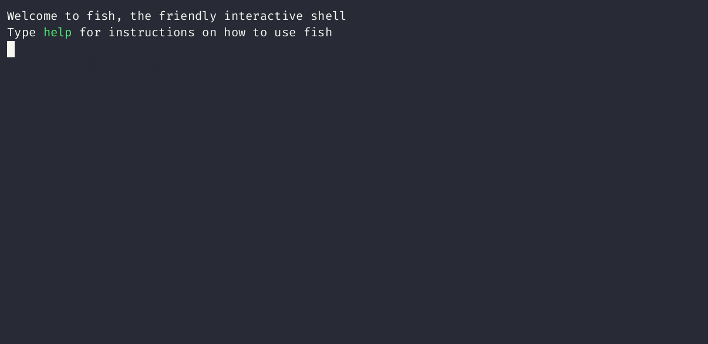
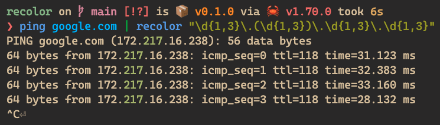
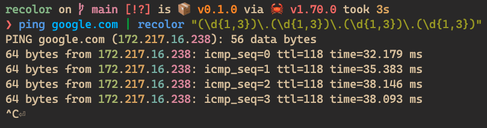
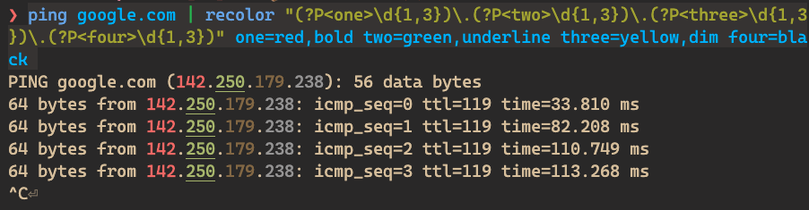

# recolor

[](https://github.com/samwho/recolor/actions)
[](https://crates.io/crates/recolor)

`recolor` is a tool to help you colourise the output of any command. It works
using familiar regular expressions, and gives you lots of flexibility and
control in what the output looks like.



## Installation

### Homebrew (Mac)

```bash
brew tap samwho/tap
brew install recolor
```

### From source

Requires [Rust](https://rustup.rs/) to be installed on your system, so you have
access to the `cargo` command:

```bash
cargo install recolor
```

## How it works

`recolor` reads input line by line and applies the regular expression you
specify to each line. It colours capture groups only, and if you name your
capture groups you can customise the colours used.

As an example, the following will colour only the 2nd octet of any IPv4
addresses output by `ping`:

```bash
$ ping google.com | recolor "\d{1,3}\.(\d{1,3})\.\d{1,3}\.\d{1,3}"
```



We could colour all 4 octets separately, `recolor` has a set of default
colours it cycles through each new capture group:



If we wanted to control the styling, we can name our capture groups and
specify the styling after the regex.

```bash
$ ping google.com | recolor "(?P<one>\d{1,3})\.(?P<two>\d{1,3})\.(?P<three>\d{1,3})\.(?P<four>\d{1,3})" one=red,bold two=green,underline three=yellow,dim four=black
```



# FAQ

## Does it support multiline regular expressions?

No, and I don't have plans to. It would make the code significantly more
complicated. If it's something you really, really want I would happily review a
PR, though.

## What styles are available?

Here's a list of all of the words you can use as styles:

```
black
red
green
yellow
blue
magenta
cyan
white
bright_black
bright_red
bright_green
bright_yellow
bright_blue
bright_magenta
bright_cyan
bright_white
bold | bolded
dimmed | dim
italic | italics
underline | underlined
blink | blinking
hidden
strikethrough | struckthrough | strike
```

You can also specify colours as CSS style hex values, e.g. `#ff0000` for red.
